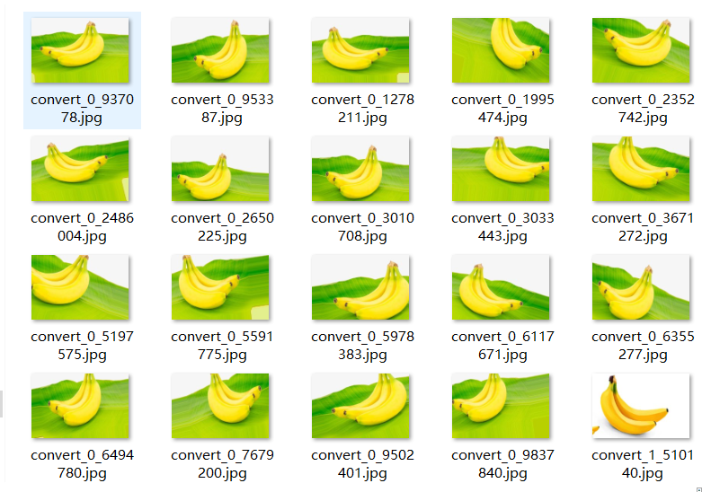

# Image Data Augmentation

###### Image data augmentation is a technique that can be used to artificially expand the size of a training dataset by creating modified versions of images in the dataset.

Training deep learning neural network models on more data can result in more skillful models, and the augmentation techniques can create variations of the images that can improve the ability of the fit models to generalize what they have learned to new images.

The Keras deep learning neural network library provides the capability to fit models using image data augmentation via the *ImageDataGenerator* class.

In this code, you will discover how to use image data augmentation when training deep learning neural networks.

## Introduction

In this code, you will know:

- Image data augmentation is used to expand the training dataset in order to improve the performance and ability of the model to generalize.

- Image data augmentation is supported in the Keras deep learning library via the *ImageDataGenerator* class.

- How to use shift, flip, brightness, and zoom image data augmentation.

  

## Output

Generated images are placed in the 'output' folder:

## Something else

1. Variables 'path' and 'dis_path' is the path of images
2. The generated image  default target size is (534, 800), and you can change it whatever you want
3. Image default save format is '*.jpg'
4. For more information, please visit : https://keras.io/preprocessing/image/